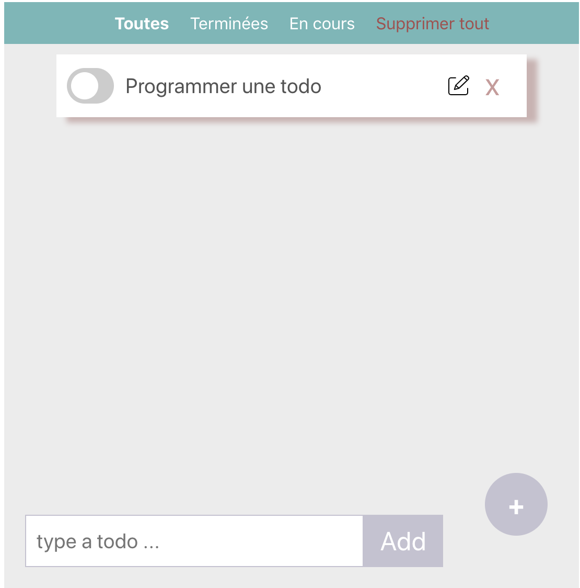
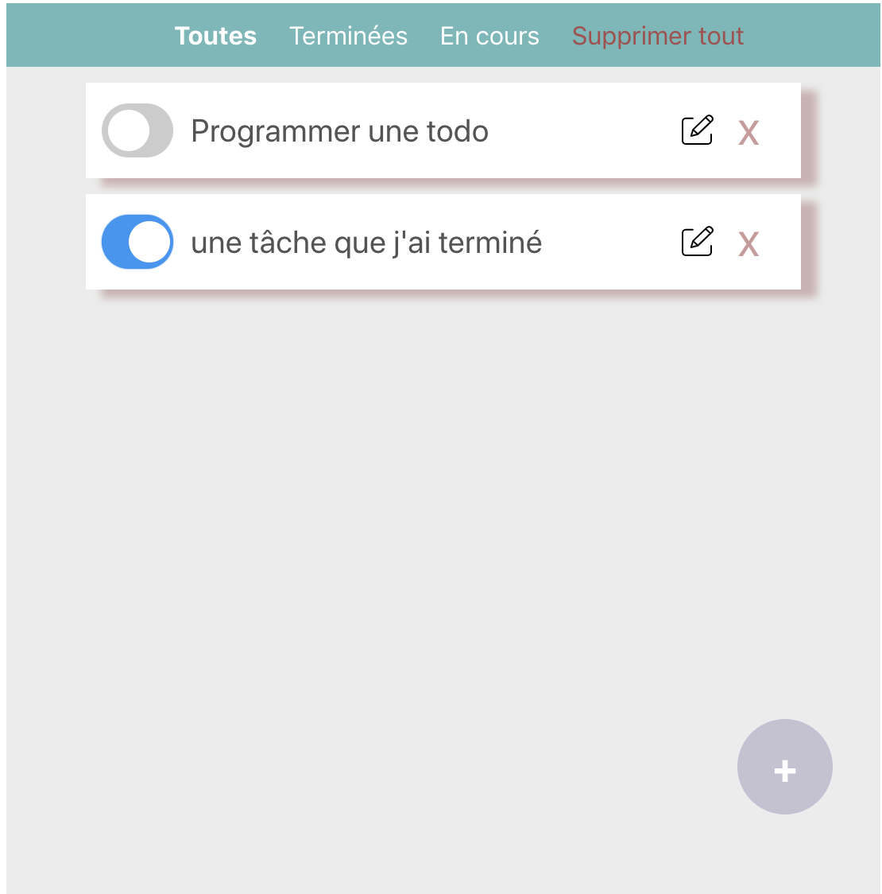

   

Install all dependencies of the todo list project 

### `npm Install`

To running the project:

### `npm start`

Runs the app in the development mode. 

Open [http://localhost:3000](http://localhost:3000) to view it in the browser.

To view in production. 

Open [https://nerice-dev.github.io/todo-list](https://nerice-dev.github.io/todo-list) to view it in the browser.

